# Awesome Enterprise Search Platform 🔍

  

  
  
  
  
  

## 🚀 Top Enterprise Search Platforms Ecosystem

A curated list of **SaaS Enterprise Search Platforms**, **AI-Powered RAG Solutions**, and **Open-Source Search Engines**. This guide evaluates workplace search tools, cross-application data connectors, permission-aware indexing, vector database search, and unified knowledge discovery engines.

> **Last updated: September 2026** 📅

---

## 📑 Table of Contents
- [📊 SaaS & Hosted Enterprise Search Platforms](#-saas--hosted-enterprise-search-platforms)
- [⚡ Open-Source GitHub Projects](#-open-source-github-projects)
- [🛠️ How to Contribute](#️-how-to-contribute)
- [🤝 Support & Community](#-support--community)
- [📈 Star History](#-star-history)
- [⚠️ Disclaimer](#️-disclaimer)

---

## 📊 SaaS & Hosted Enterprise Search Platforms

### 💡 Market Overview & Industry Dynamics
- **Estimated Market Size**: The global Enterprise Search market size is valued at approximately **$6.2 Billion (2026)** and is projected to reach **$11.8 Billion by 2030**, expanding at a CAGR of ~17.5% driven by enterprise Generative AI and RAG adoption.
- **Market Fragmentation**: The market is **moderately fragmented**. Established tech giants (Microsoft, Google Cloud, IBM) hold significant enterprise infrastructure share, while specialized AI-native category leaders (Glean, Coveo, Algolia) capture high-growth workplace search and digital experience segments.

> **Note**: Products are ordered by estimated corporate scale (valuation / market capitalization / ARR).

| 🏢 Platform | 📝 Description | 💰 Starting Tier Price | 🎁 Free Tier / Trial Limit | 📊 Scale (Valuation / Market Cap / ARR) |
| :--- | :--- | :--- | :--- | :--- |
| **[Glean](https://www.glean.com/)** | AI-powered enterprise workplace search & RAG assistant with permissions awareness. | ~$45 - $75 per user/month (FlexCredits pooled AI; $50k+ annual contract min.) | No free tier; 14-day sales-led sandbox POC upon demo request | **$7.2 Billion Valuation** ($300M ARR) |
| **[Elastic Enterprise Search](https://www.elastic.co/)** | Enterprise search & workplace connectors built on Elastic Stack with hybrid ranking. | $95/month (Standard Cloud Elastic deployment tier) | 14-day free trial (full Elastic Cloud deployment features) | **$8.6 Billion Market Cap** (Public: ESTC) |
| **[Algolia Enterprise Search](https://www.algolia.com/)** | API-first search-as-a-service for product, application, and digital experience search. | $0.50 per 1,000 search requests (Grow plan usage-based) | **Free Forever**: 10,000 search requests & 100k records / month | **$2.25 Billion Valuation** ($100M ARR) |
| **[IBM Watson Discovery](https://www.ibm.com/)** | Enterprise content intelligence, document processing & AI knowledge discovery. | $500/month (Plus plan tier) | 30-day free trial (IBM Cloud Lite environment limits) | **~$190 Billion Market Cap** (IBM Enterprise Unit) |
| **[Coveo](https://www.coveo.com/)** | Enterprise AI relevance platform for unified digital experience and workplace search. | Usage-based starting at ~$1,500/month custom query tiers | 14-day free trial for developer console configuration | **~CAD $385 Million Market Cap** (TSX: CVO) |
| **[Yext Search](https://www.yext.com/)** | Structured search platform powered by knowledge graphs and multi-channel connectors. | $4/week ($199/year per location for Starter tier) | 14-day free trial on selected packages | **~$700 Million Valuation** (Private Equity acquired) |
| **[Lucidworks](https://lucidworks.com/)** | Large-scale enterprise search & neural hybrid ranking platform (Fusion engine). | Enterprise tier starting ~$2,000/month deployment quote | 30-day guided evaluation trial for enterprise teams | Estimated **~$500 Million Valuation** |
| **[Sinequa](https://www.sinequa.com/)** | High-security intelligent enterprise search with deep cloud & hybrid connectors. | Enterprise license starting ~$3,000/month quote | Custom sales-led proof-of-concept trial (typically 30 days) | Estimated **~$250 Million Valuation** |
| **[SearchUnify](https://www.searchunify.com/)** | Unified cognitive search and support knowledge discovery platform. | Standard plan starting ~$1,000/month custom subscription | 14-day free trial available on request | Estimated **~$50 Million Valuation** |

---

## ⚡ Open-Source GitHub Projects

Explore top-tier open-source enterprise search servers, vector databases, neural search engines, and AI/RAG workplace frameworks.

> **Note**: Repositories are sorted by GitHub Star count in descending order.

- **[RAGFlow](https://github.com/infiniflow/ragflow)**   
  *Open-source RAG (Retrieval-Augmented Generation) engine based on deep document understanding and hybrid retrieval for enterprise knowledge bases.*

- **[Elasticsearch](https://github.com/elastic/elasticsearch)**   
  *Industry-standard search and analytics engine supporting full-text search, dense vector embeddings, hybrid ranking, and distributed enterprise scale.*

- **[Meilisearch](https://github.com/meilisearch/meilisearch)**   
  *Lightning-fast, developer-friendly open-source search engine with typo tolerance, instant search response, and effortless deployment.*

- **[Milvus](https://github.com/milvus-io/milvus)**   
  *Cloud-native open-source vector database built for scalable similarity search, AI embeddings management, and enterprise neural retrieval.*

- **[Qdrant](https://github.com/qdrant/qdrant)**   
  *High-performance vector search engine and database written in Rust, featuring extended filtering and payload payload indexing for AI applications.*

- **[Onyx (formerly Danswer)](https://github.com/onyx-dot-app/onyx)**   
  *Open-source AI enterprise search and RAG platform with built-in connectors for Slack, Google Drive, Notion, GitHub, and permission-aware Q&A.*

- **[Typesense](https://github.com/typesense/typesense)**   
  *Fast, open-source, typo-tolerant search engine optimized for developer productivity and seamless self-hosted enterprise search experiences.*

- **[OpenSearch](https://github.com/opensearch-project/OpenSearch)**   
  *Community-driven, Apache 2.0-licensed open-source search and analytics suite offering neural search, k-NN vector retrieval, and enterprise security features.*

- **[Vespa](https://github.com/vespa-engine/vespa)**   
  *High-scale open-source engine for vector search, full-text retrieval, real-time machine-learned ranking, and enterprise recommendation systems.*

- **[Apache Solr](https://github.com/apache/solr)**   
  *Battle-tested, Lucene-based open-source enterprise search platform providing distributed indexing, hit highlighting, and faceted search.*

- **[Fess](https://github.com/codelibs/fess)**   
  *Turnkey open-source enterprise search server built on OpenSearch/Elasticsearch with out-of-the-box crawlers for web, file servers, DBs, and cloud storage.*

---

## 🛠️ How to Contribute

Contributions are warmly welcomed! Help keep this repository comprehensive and up-to-date:

1. 🍴 **Fork** the repository.
2. 📝 **Add/edit** entries in `README.md` following the established table or badge structure.
3. 🔎 **Ensure details** (pricing, scale, open-source links) are factual and verifiable.
4. 📬 **Submit a Pull Request** with a clear title and summary of changes.

---

## 🤝 Support & Community

If you find this repository helpful, please consider supporting the project:

- ⭐ **Star** this repository to show your appreciation!
- 🔀 **Fork** it to keep a copy or contribute your own improvements.
- 📢 **Share** it with fellow search engineers, knowledge managers, and AI developers.
- ☕ **Buy Me a Coffee / Sponsor**: Support ongoing maintenance on the [GitHub Sponsors Dashboard](https://github.com/sponsors/ishandutta2007).

---

## 📈 Star History

---

## ⚠️ Disclaimer

- This list is **community-curated** for informational and research purposes.
- Enterprise search platforms handle sensitive organizational data. Open-source deployments require proper document-level security, access control (RBAC), and governance compliance.
- Product pricing and valuations are estimated based on public disclosures and industry reports as of **September 2026**.

---

**Made with ❤️ for knowledge managers, search architects, and open-source search enthusiasts.**
